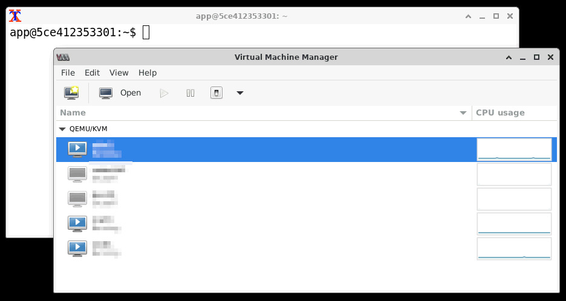

# virt-manager-docker



Minimal Docker container for running `virt-manager` over XFCE + VNC.

Docker Hub image: [itefixnet/virt-manager](https://hub.docker.com/r/itefixnet/virt-manager)

## What this provides

- `virt-manager`
- Lean XFCE components (not full desktop meta package)
- TigerVNC server on port `5901`
- Default user `app` (UID/GID `1000`)
- Host libvirt socket passthrough (`/var/run/libvirt`)

## Current behavior

- Container starts as root only for bootstrap.
- Startup script detects host libvirt socket (`libvirt-sock` or `virtqemud-sock`).
- It maps the socket GID into the container and adds `app` to that group.
- It then drops privileges and runs desktop apps as `app`.
- `virt-manager` launches pre-connected to host libvirt via socket URI.

## Build

```bash
docker build -t virt-manager .
```

Optional custom default user:

```bash
docker build -t virt-manager \
  --build-arg USERNAME=myuser \
  --build-arg UID=1000 \
  --build-arg GID=1000 \
  .
```

## Pull from Docker Hub

```bash
docker pull itefixnet/virt-manager:latest
```

## Run (Compose recommended)

Use local build:

```bash
docker compose up -d --build
```

Use Docker Hub image:

```bash
docker run -d \
  --name virt-manager \
  --security-opt seccomp=unconfined \
  -p 5901:5901 \
  -e VNC_PASSWORD=changeme \
  -e VNC_GEOMETRY=1280x800 \
  -e VNC_DEPTH=24 \
  -v /var/run/libvirt:/var/run/libvirt \
  itefixnet/virt-manager:latest
```

Stop:

```bash
docker compose down
```

Compose file: [docker-compose.yml](docker-compose.yml)

## Connect

- Open VNC viewer to `localhost:5901`.
- Login with `VNC_PASSWORD` (default set in [docker-compose.yml](docker-compose.yml)).
- `virt-manager` should auto-open using:
  - `qemu+unix:///system?socket=/var/run/libvirt/libvirt-sock`

If needed, manually add the same URI via **File → Add Connection**.

## Environment knobs

Most setups only need `VNC_PASSWORD`, `VNC_GEOMETRY`, and `VNC_DEPTH`.

- `VNC_PASSWORD` (default: `changeme`)
- `VNC_GEOMETRY` (default: `1280x800`)
- `VNC_DEPTH` (default: `24`)
- `XTERM_FONT` (default: `Monospace`)
- `XTERM_FONT_SIZE` (default: `14`)

## Xterm fonts and sizes

List available font families inside the running container:

```bash
docker exec virt-manager sh -lc "fc-list : family | tr ',' '\n' | sed 's/^ *//;s/ *$//' | sort -u"
```

`XTERM_FONT_SIZE` is numeric (Xft point size). Typical values: `12`, `14`, `16`, `18`, `20`.

Example override in [docker-compose.yml](docker-compose.yml):

```yaml
environment:
  XTERM_FONT: DejaVu Sans Mono
  XTERM_FONT_SIZE: 18
```

## Troubleshooting

### Black screen after VNC login

- Ensure Compose uses `seccomp=unconfined` (already set in [docker-compose.yml](docker-compose.yml)).
- Recreate container:

```bash
docker compose down
docker compose up -d --build --force-recreate
```

### `virt-manager` says libvirtd is not installed

- This usually means socket permission mismatch.
- Verify `app` group membership and socket group:

```bash
docker exec virt-manager sh -lc 'id app && ls -ln /var/run/libvirt/libvirt-sock'
```

- `app` should include the socket GID.

### Harmless message: migration app failed to launch

- This is a runtime seccomp/glib spawn quirk and can be ignored.
- Panel/desktop helpers are disabled by default to reduce these popups.

### Error opening VM graphical console remotely

If you see:

`Guest is on a remote host with transport 'unix' but is only configured to listen locally`

Set the VM display listen address away from localhost:

- In VM hardware settings, open **Display Spice** (or **VNC**).
- Change listen address from `127.0.0.1`/`localhost` to host IP or `0.0.0.0`.
- Restart VM and reconnect console.

## Notes

- The image is intentionally minimal.
- Change default VNC password for non-local use.
- Runtime socket-group mapping is handled automatically at startup; no manual `group_add` is required.
